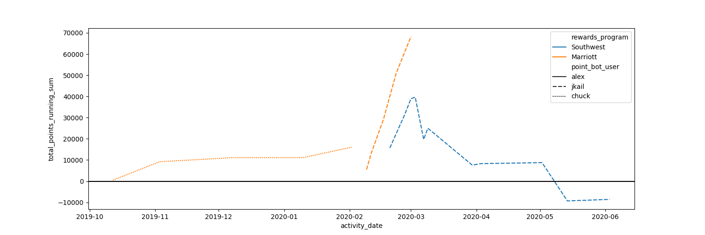

# PointBot

PointBot is a backend application written in Python that aggregates loyalty program points from various credit cards, airlines and hotels into one centralized place. It automates the scraping process of loyalty accounts using a headless Selenium WebDriver deployed on AWS EC2 and leverages Auth0 for secure login and authentication. Additionally, user passwords are securely stored as encrypted objects in an S3 bucket that is accessible only by a specialized service, ensuring user privacy and security. To get around "scraping and automation detection" I created a hacky "nordVPN" script that runs the bots inside of a VPN that has a randomized locaiton and user agent. (This is a greyzone for terms and conditions for most of these programs)





## Features

### Loyalty Program Scraping:
PointBot supports scraping loyalty points from the following programs:
- Marriott Bonvoy
- Southwest Airlines
- United Airlines
- Hyatt
- Delta Airlines
- American Airlines
- MGM Resorts

### Authentication:
Secure authentication is handled through Auth0 to protect user credentials.

### Password Encryption:
User passwords are stored in encrypted form on AWS S3 to ensure privacy and security, accessible only by an external service.

### Headless Mode:
Selenium web scraping is performed in headless mode on AWS EC2 for efficient and invisible operations.

## Prerequisites
To run PointBot, ensure you have the following set up:
- Python 3.8+
- AWS EC2 instance with necessary permissions
- AWS S3 bucket for password storage
- Auth0 account for authentication

The following Python libraries (install using pip):
- `pandas`
- `selenium`
- `boto3` (for AWS S3)
- `cryptography` (for encryption)

Other required dependencies (can be found in the `requirements.txt` file).

## Setup

1. Clone the repository:
```bash
git clone https://github.com/yourusername/point_bot.git
cd point_bot
```

2. Install the required dependencies:
```bash
pip install -r requirements.txt
```

3. Configure the following environment variables:
```bash
export AUTH0_CLIENT_ID=your_auth0_client_id
export AUTH0_DOMAIN=your_auth0_domain
export AUTH0_CLIENT_SECRET=your_auth0_client_secret
export AWS_ACCESS_KEY_ID=your_aws_access_key_id
export AWS_SECRET_ACCESS_KEY=your_aws_secret_access_key
export S3_BUCKET_NAME=your_s3_bucket_name
```

4. Set up your AWS EC2 instance and ensure the necessary permissions are granted to access S3 and other services.

5. Store your encrypted credentials on AWS S3.

## Running the Application

To run the PointBot application for testing or production, execute the following command:

```bash
python3 main.py
```

The `main.py` file runs the scraping logic, starting with user setup, authentication, and retrieving loyalty points from the supported loyalty programs.

## Main Components

- **PointBotSetup**: Handles the setup of the bot, including selecting the specific loyalty programs to scrape.
- **PointBotEncryption**: Encrypts and decrypts sensitive user data before storing it in S3.
- **Point_Bot_User**: Fetches and manages user profiles for the bot's operations.
- **MarriottBot, SouthwestBot, UnitedBot, HyattBot, DeltaBot, AmericanAirlinesBot, MgmBot**: Individual scrapers for each loyalty program that are responsible for logging into accounts and scraping point balances.
- **VisualizeData**: Handles visualizing the aggregated data once the points are scraped from various programs.

## Sample Data

Below is a sample of the aggregated loyalty program data collected by PointBot:

| DATE        | CATEGORY     | DESCRIPTION                                                   | POINTS      |
| ----------- | ------------ | ------------------------------------------------------------- | ----------- |
| Jun 3, 2020 | Credit Card  | Rapid Rewards Credit Card 06/02/2020                           | +730 PTS    |
| May 14, 2020| Flight       | REDEEM - LKEU6D - Las Vegas, NV - LAS to Denver...             | -9,039 PTS  |
| Mar 1, 2020 | Flight       | Q8L7PF - Denver, CO - DEN to Seattle/Tacoma, WA...             | +7,566 PTS  |
| Mar 1, 2020 | Flight       | REDEEM - SV9F2P - Salt Lake City, UT - SLC to...               | -19,923 PTS |
| Mar 7, 2020 | Flight       | REDEEM - TXGYBP - Denver, CO - DEN to Salt Lake City...        | -19,923 PTS |
| Feb 27, 2020| Flight       | W7ZH55 - Denver, CO - DEN to Seattle/Tacoma, WA...             | +15,696 PTS |

## Testing

For testing purposes, the following code snippet in `main.py` allows you to run the scraper in non-headless mode and run bots for specific users:

```python
if __name__ == "__main__":
    headless = False  # Set to False to run in non-headless mode
    for user in ['chuck']:
        pbs = PointBotSetup(
            point_bot_user=user,
            headless=headless,
            offlinemode=0,
            runspecificbots=['Hyatt']
        )
        pbs.start()
        print(f'\n\n\n Headless = {headless} \n\n\n')

        pbu = Point_Bot_User(pbs)
        for kwargs in pbs.selectparameters():
            if kwargs['rewards_program_name'] == 'Hyatt' and kwargs['run'] == 1:
                mb = HyattBot(pbs, **kwargs)
                mb.mine_hyatt_points()
                pbs.user_rewards_info_df = mb.pbs.user_rewards_info_df

        pbs.closeoutfunction()

    vds = VisualizeData(pbs, 'jkail')
    vds.main()
```

## Deployment

- **AWS EC2 Instance**: Ensure that your instance is configured to run the necessary services such as Selenium WebDriver with Chrome, and all the dependencies are installed.
- **Auth0 Configuration**: Make sure your Auth0 application is set up and the necessary client ID, domain, and secret are added to the environment variables.
- **AWS S3 for Secure Storage**: Ensure your S3 bucket is correctly set up with encryption enabled and limited access.

## Future Enhancements

- Add more loyalty programs to support additional airlines, hotels, and other rewards platforms.
- Improved error handling to manage failed logins and connectivity issues more gracefully.
- Scheduled scraping using AWS Lambda or other serverless computing options to run scrapes automatically.

## License

This project is licensed under the MIT License. See the LICENSE file for details.

Happy scraping with PointBot!
