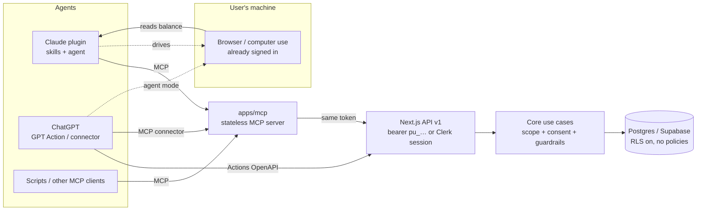

# Agents: MCP server, Claude plugin, ChatGPT, and consented write-back

PointUp is a hybrid agent app: humans use the dashboard, and *their* agents
(Claude, ChatGPT, scripts) can manage the portfolio and — with explicit consent —
read balances from provider sites in the user's **own signed-in browser** and
write them back.

## Layers (all in `@pointup/core`, `domain/agent` + `application/agent`)

| Concept | Type | Rule it enforces |
| --- | --- | --- |
| `AccessToken` | aggregate | SHA-256 hash stored only; plaintext shown once; scoped; expiring; revocable |
| `ConsentGrant` | aggregate | Per provider, 1–90 days, revocable; **no consent → no write-back** |
| `AgentSkill` | catalog (data) | Allowed hosts, start URL, steps; one browser + one computer-use skill per provider |
| `SubmitObservation` | use case | skill → https + host allow-list → consent → account ownership → plausibility → write → audit |
| `AgentObservation` | audit log | Append-only; stores the host only, never the URL |

Ports/adapters follow the existing pattern: repositories are interfaces in the
domain, Drizzle adapters live in `infrastructure/repositories/drizzle-agent-repositories.ts`,
and tests run against in-memory fakes *and* a real Postgres
(`test/drizzle-agent.integration.test.ts`, enabled by `TEST_DATABASE_URL`).

## Security model

1. **No credentials.** Agents read a page the user is already signed in to. Skills
   tell agents to stop on login/MFA/CAPTCHA. PointUp never receives a password.
2. **Least privilege tokens.** `portfolio:read`, `portfolio:write`,
   `observations:write`, `consents:manage`. Browser sessions are trusted for all;
   tokens only for what they hold. Token minting is session-only — a token can't
   create tokens.
3. **Consent is separate from scope.** Even with `observations:write`, the write is
   refused (`CONSENT_REQUIRED`, 403) without an active per-provider consent. The
   MCP tool `pointup_request_consent` asks the *user* through MCP elicitation;
   clients that can't prompt get a dashboard link instead. There is intentionally
   no blind grant tool.
4. **Allow-listed hosts.** `sourceUrl` must be https on the skill's hosts (suffix match
   on a dot boundary: `united.com.evil.example` is rejected).
5. **Plausibility guard.** A reading that jumps ≥10× from the last balance is held as
   `needs_review` until the user confirms (`confirmed: true`).
6. **Audit.** Every attempt that reaches an account is recorded and visible at
   *Dashboard → Agents*.
7. **Database.** RLS is enabled on every table with no policies (migration `0009`),
   so Supabase's auto-generated REST API exposes nothing.

## Surfaces

| Surface | Where | Auth |
| --- | --- | --- |
| MCP (stdio) | `apps/mcp` (`POINTUP_TOKEN`) | PAT |
| MCP (remote HTTP, stateless) | `node apps/mcp/dist/index.mjs --http` or `Dockerfile.mcp` | PAT per request, forwarded to the API |
| Claude Code plugin | `plugins/claude` + `.claude-plugin/marketplace.json` | PAT via `POINTUP_TOKEN` |
| ChatGPT GPT Action | `plugins/chatgpt` (spec generated from the zod contracts) | PAT as API-key bearer |
| ChatGPT / claude.ai connector | remote MCP URL | PAT header |

### MCP tools

Read: `pointup_get_portfolio_summary`, `_list_accounts`, `_get_account`, `_list_providers`,
`_get_balance_history`, `_list_expiring`, `_get_value_advice`, `_list_goals`, `_list_activity`.
Write: `pointup_link_account`, `_record_balance` (user-stated), `_create_goal`.
Agent: `pointup_list_skills`, `_request_consent`, `_submit_balance`, `_list_observations`.
Prompts: `capture-balance`, `portfolio-review`.

## Adding a program or skill

Add the provider to `PROVIDER_CATALOG` and a seed in `domain/agent/skill.ts`
(start URL, allowed hosts, hint). Browser and computer-use skills are generated
from the seed; the catalog test asserts the start URL sits on an allowed host.

## Not built yet (deliberately)

- OAuth for ChatGPT/claude.ai connectors (per-user authorization instead of a
  pasted PAT). The PAT path is the supported one today.
- Deterministic scrapers (Playwright scripts) that run without an LLM; skills are
  playbooks for LLM agents.
- Rate limiting on `/api/v1/agent/observations` (see the roadmap's cross-cutting track).
