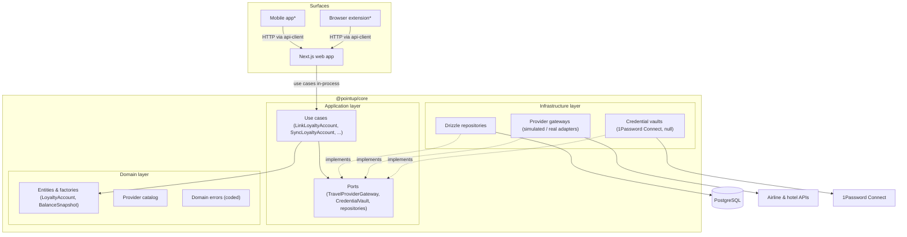

# Architecture

PointUp is organized as a workspace monorepo around a framework-agnostic core, following domain-driven design (DDD) with a hexagonal (ports & adapters) layering. The goal is that business logic never depends on a delivery mechanism: the web app is just one surface, and mobile apps, browser extensions, background workers, and CLIs can all reuse the same core.

## Workspace layout

```
├── apps/
│   └── web/                  # Next.js surface (presentation + composition root)
├── packages/
│   ├── core/                 # Domain + application + infrastructure (no framework deps)
│   └── api-client/           # Typed HTTP client for external surfaces
├── infra/                    # AWS CDK (standalone package)
└── docs/
```

## Layers inside `@pointup/core`



\* future surfaces; see [multi-surface.md](./multi-surface.md).

### Domain layer (`packages/core/src/domain`)

Pure business knowledge with zero IO:

- **Entities and factories** — `LoyaltyAccount` and `BalanceSnapshot` are immutable shapes created through factories (`createLoyaltyAccount`, `createBalanceSnapshot`) that enforce invariants (supported provider, non-empty membership number, non-negative integer points).
- **Provider catalog** — the list of supported programs is domain knowledge (`provider.ts`). Providers are grouped into kinds (`airline`, `hotel`, `credit_card`, `rail`, `shopping`); adding a provider is a one-line catalog change, and adding a whole new kind is a one-line change to `PROVIDER_KINDS` that flows through contracts, summaries, and dashboards automatically.
- **Strict dates** — balance snapshots validate their capture timestamps (no invalid or future-dated entries via `InvalidCaptureTimeError`), and the wire contracts only accept strict ISO-8601 UTC strings.
- **Repository ports** — persistence interfaces (`LoyaltyAccountRepository`, `BalanceSnapshotRepository`) owned by the domain, implemented by infrastructure (dependency inversion).
- **Coded errors** — every `DomainError` subclass carries a stable `code` (`DUPLICATE_LOYALTY_ACCOUNT`, `PROVIDER_NOT_SUPPORTED`, ...) so all surfaces can map failures to UX without string parsing.

### Application layer (`packages/core/src/application`)

One class per use case (single responsibility), with dependencies injected through constructors:

| Use case | Responsibility |
| --- | --- |
| `ListProviders` | Expose the provider catalog |
| `LinkLoyaltyAccount` | Link a program membership to a user, rejecting duplicates |
| `ListLoyaltyAccounts` | Return accounts with latest balances as read models |
| `GetLoyaltyAccount` | Return one owned account with its latest balance |
| `UpdateLoyaltyAccount` | Change membership number / credential ref with invariants enforced |
| `UnlinkLoyaltyAccount` | Delete an owned account (snapshots cascade) |
| `GetBalanceHistory` | Snapshot history for one account, newest first, clamped limit |
| `RecordManualBalance` | Append a user-keyed balance snapshot (`source: "manual"`) |
| `GetPortfolioSummary` | Aggregate totals, per-kind breakdown, last sync across a user |
| `SyncLoyaltyAccount` | Resolve credentials, fetch balance via gateway, append a snapshot |
| `SyncAllLoyaltyAccounts` | Best-effort batch sync with per-account outcomes |

Cross-cutting ownership checks live in `application/loyalty/access.ts` (`requireOwnedAccount`): accounts belonging to other users always surface as not-found, never as forbidden, so their existence is not revealed.

The application layer also owns the **outbound ports**:

- `TravelProviderGateway` — airline/hotel integrations
- `CredentialVault` — resolving credential references (1Password, etc.)
- `Clock` — deterministic time under test

Use cases return **read models** (plain serializable shapes), not ORM rows and not wire DTOs.

### Contracts (`packages/core/src/contracts`)

The wire format of the HTTP API, defined once with zod schemas plus mappers from read models to DTOs. This module depends only on zod, so any surface can import `@pointup/core/contracts` without pulling in server-side code.

### Infrastructure layer (`packages/core/src/infrastructure`)

Adapters implementing the ports:

- **Drizzle repositories** over PostgreSQL (`drizzle-orm` + `postgres-js`). The schema lives in `infrastructure/db/schema.ts`; migrations are generated by drizzle-kit into `packages/core/drizzle/`. Identity is managed by Clerk, so the schema contains only domain tables keyed by Clerk user ids. Integrity invariants are enforced at the storage layer too: a unique `(user_id, provider_id)` index backs up the use case's duplicate check (concurrent links can't race past it — violations are translated back into `DuplicateLoyaltyAccountError`), and latest-balance lookups use `SELECT DISTINCT ON` so one row per account is picked server-side instead of shipping whole histories to the app.
- **`CompositeTravelProviderGateway`** routes each fetch to the first registered gateway supporting the provider — real integrations are added by writing one adapter and registering it, without touching existing code (open/closed). `SimulatedTravelProviderGateway` is the development fallback.
- **Credential vaults** — `OnePasswordConnectVault` (server-side vault) and `NullCredentialVault` (no server vault; surfaces supply transient credentials). See [integrations.md](./integrations.md).

`createDb(connectionString)` takes the connection string as an argument: the core never reads environment variables. Configuration is a host concern.

## The web surface (`apps/web`)

The Next.js app is a thin delivery mechanism:

- **Composition root** (`src/server/container.ts`) — the only place that instantiates concrete implementations and wires them into use cases. Each surface/host builds its own container.
- **Route handlers** (`src/app/api/v1/...`) — controllers that authenticate, validate input with the contract schemas, call a use case, and serialize read models to DTOs. Error serialization is centralized in `src/server/http.ts`; the error-code → HTTP-status mapping itself is part of the wire contract (`HTTP_STATUS_BY_ERROR_CODE` in `@pointup/core/contracts`), tested in core and shared with every surface.
- **Server actions** (`src/app/actions.ts`) — the same thin-controller pattern for the dashboard forms.
- **Auth** — [Clerk](https://clerk.com/) manages users, sessions, and sign-in UI. `clerkMiddleware` runs in the Next.js proxy (`src/proxy.ts`) and `auth()` supplies the user id to controllers; the domain treats it as an opaque string, so swapping identity providers would touch only the web surface.
- **UI** — branded components in `src/components/` built on Tailwind v4 design tokens (`src/styles/globals.css`); see [brand.md](./brand.md).
- **Env validation** (`src/env.ts`) — zod-validated configuration, including composing `DATABASE_URL` from the RDS secret fields ECS injects.

## The worker surface (`apps/worker`)

Background jobs are a second host over the same core — proof that the hexagon has more than one side:

- **Composition root** (`src/container.ts`) mirrors the web container: Drizzle repositories, the provider gateway, and the credential vault wired into `SyncAllLoyaltyAccounts` and `BuildPortfolioDigest`.
- **Jobs** are thin orchestrators: `sync` refreshes every user's balances; `digest` renders and emails a portfolio summary per user.
- **Ports it introduces** (owned by the application layer in core):
  - `Mailer` — implemented by `SesMailer` (AWS SES), `SmtpMailer` (any SMTP endpoint; [Mailpit](https://mailpit.axllent.org/) in local dev), and `ConsoleMailer` (default)
  - `UserDirectory` — resolves a user id to an email; implemented against Clerk's backend API, with a static override for development
- **Packaging** — esbuild bundles the worker into a single `dist/index.cjs`; `Dockerfile.worker` ships it as a minimal image with no runtime `node_modules`.
- **Scheduling** — in AWS, two EventBridge-scheduled Fargate tasks (`sync` every 6 hours, `digest` weekly). Locally: `docker compose run --rm worker sync|digest`, with digests landing in Mailpit's UI.
- **Migrations** — the image also carries the drizzle SQL migrations and a `migrate` job; CI runs it as a one-off Fargate task after each deploy (drizzle's migrator takes a session advisory lock, so racing deploys serialize safely).

## SOLID mapping

| Principle | Where it shows up |
| --- | --- |
| Single responsibility | One use case per class; controllers only translate HTTP ↔ use cases |
| Open/closed | New providers = catalog entry + optional gateway adapter registered in the composite; no edits to existing logic |
| Liskov substitution | Any `TravelProviderGateway`/`CredentialVault`/repository implementation is interchangeable (fakes in tests, simulated gateway in dev, real adapters in prod) |
| Interface segregation | Ports are small and purpose-specific (`CredentialVault` has one method) |
| Dependency inversion | Domain/application define interfaces; infrastructure implements them; only composition roots know concrete types |

## Testing strategy

Because use cases depend only on ports, the application and domain layers are tested with in-memory fakes (`packages/core/test/`) — no database, no network, milliseconds per run. Integration points (Drizzle repositories, HTTP routes) are exercised by the build and by end-to-end smoke tests against a real PostgreSQL instance.

## Infrastructure (AWS)

See the root [README](../README.md#deploying-to-aws) for the deployment topology: ECS Fargate + ALB + RDS PostgreSQL + Secrets Manager, all defined with AWS CDK in `infra/`.
