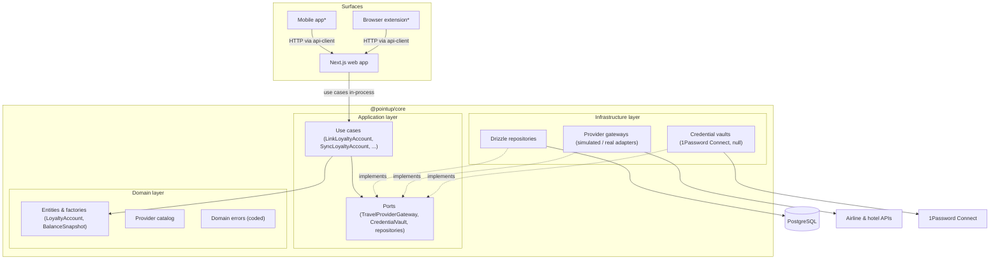
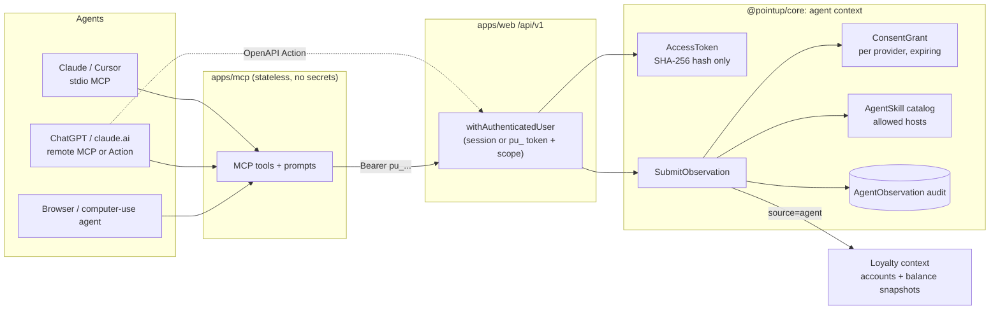
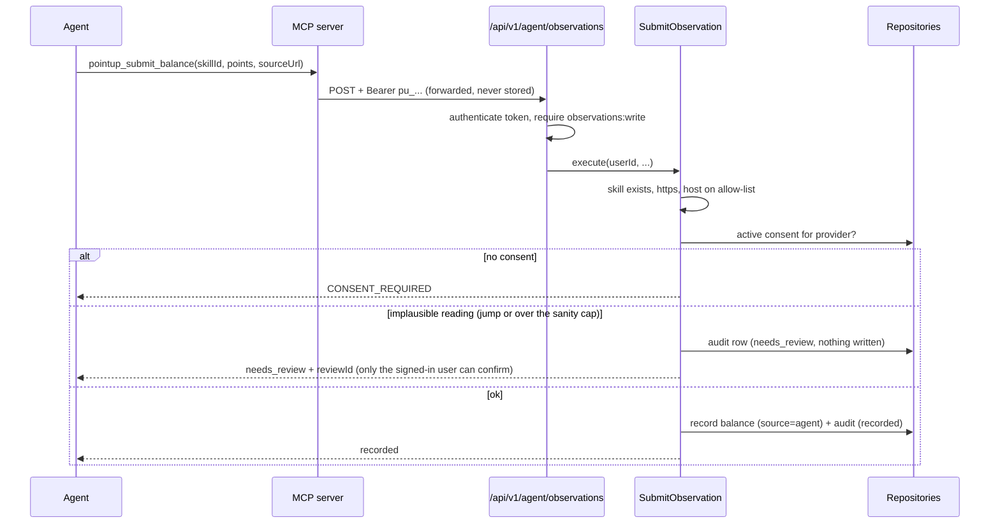
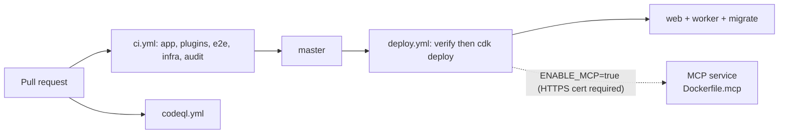

# Architecture

PointUp is organized as a workspace monorepo around a framework-agnostic core, following domain-driven design (DDD) with a hexagonal (ports & adapters) layering. The goal is that business logic never depends on a delivery mechanism: the web app is just one surface, and mobile apps, browser extensions, background workers, and CLIs can all reuse the same core.

## Workspace layout

```
├── apps/
│   ├── web/                  # Next.js surface (presentation + composition root)
│   ├── mcp/                  # MCP server (stdio + stateless HTTP) over the API
│   ├── worker/ bot/          # background jobs; Slack/Discord chat surface
│   └── extension/            # Chrome MV3 extension
├── packages/
│   ├── core/                 # Domain + application + infrastructure (no framework deps)
│   └── api-client/           # Typed HTTP client for external surfaces
├── plugins/                  # Claude plugin + ChatGPT Action generator
├── e2e/                      # Playwright smoke tests (standalone package)
├── infra/                    # AWS CDK (standalone package)
└── docs/
```

## Layers inside `@pointup/core`


```mermaid
flowchart TB
    subgraph surfaces [Surfaces]
        Web[Next.js web app]
        Mobile[Mobile app*]
        Ext[Browser extension*]
    end

    subgraph core ["@pointup/core"]
        subgraph application [Application layer]
            UC["Use cases (LinkLoyaltyAccount, SyncLoyaltyAccount, ...)"]
            Ports["Ports (TravelProviderGateway, CredentialVault, repositories)"]
        end
        subgraph domain [Domain layer]
            Entities["Entities & factories (LoyaltyAccount, BalanceSnapshot)"]
            Catalog[Provider catalog]
            Errors["Domain errors (coded)"]
        end
        subgraph infrastructure [Infrastructure layer]
            Repos[Drizzle repositories]
            Gateways["Provider gateways (simulated / real adapters)"]
            Vaults["Credential vaults (1Password Connect, null)"]
        end
    end

    DB[(PostgreSQL)]
    Providers[Airline & hotel APIs]
    OP[1Password Connect]

    Web -->|use cases in-process| UC
    Mobile -->|HTTP via api-client| Web
    Ext -->|HTTP via api-client| Web
    UC --> Entities
    UC --> Ports
    Repos -.implements.-> Ports
    Gateways -.implements.-> Ports
    Vaults -.implements.-> Ports
    Repos --> DB
    Gateways --> Providers
    Vaults --> OP
```

\* future surfaces; see [multi-surface.md](./multi-surface.md).

### Domain layer (`packages/core/src/domain`)

Pure business knowledge with zero IO:

- **Entities and factories** — `LoyaltyAccount` and `BalanceSnapshot` are immutable shapes created through factories (`createLoyaltyAccount`, `createBalanceSnapshot`) that enforce invariants (supported provider, non-empty membership number, non-negative integer points).
- **Provider catalog** — the list of supported programs is domain knowledge (`provider.ts`). Providers are grouped into kinds (`airline`, `hotel`, `credit_card`, `rail`, `shopping`); adding a provider is a one-line catalog change, and adding a whole new kind is a one-line change to `PROVIDER_KINDS` that flows through contracts, summaries, and dashboards automatically.
- **Strict dates** — balance snapshots validate their capture timestamps (no invalid or future-dated entries via `InvalidCaptureTimeError`), and the wire contracts only accept strict ISO-8601 UTC strings.
- **Repository ports** — persistence interfaces (`LoyaltyAccountRepository`, `BalanceSnapshotRepository`) owned by the domain, implemented by infrastructure (dependency inversion).
- **Optimizer and curated knowledge** — `domain/loyalty/optimizer.ts` (pure, deterministic redemption planning), `catalog/sweet-spots.ts` (editorial, unverified), `transfer-bonus.ts` (real bonus windows, none by default) and `transfer-partners.ts` (the graph, exact rational ratios). See [optimizer.md](./optimizer.md).
- **Coded errors** — every `DomainError` subclass carries a stable `code` (`DUPLICATE_LOYALTY_ACCOUNT`, `PROVIDER_NOT_SUPPORTED`, ...) so all surfaces can map failures to UX without string parsing.

### Application layer (`packages/core/src/application`)

One class per use case (single responsibility), with dependencies injected through constructors:

| Use case | Responsibility |
| --- | --- |
| `ListProviders` | Expose the provider catalog |
| `LinkLoyaltyAccount` | Link a program membership to a user, rejecting duplicates |
| `ListLoyaltyAccounts` | Return accounts with latest balances as read models |
| `GetLoyaltyAccount` | Return one owned account with its latest balance |
| `UpdateLoyaltyAccount` | Change membership number / credential ref with invariants enforced |
| `UnlinkLoyaltyAccount` | Delete an owned account (snapshots cascade) |
| `GetBalanceHistory` | Snapshot history for one account, newest first, clamped limit |
| `RecordManualBalance` | Append a user-keyed balance snapshot (`source: "manual"`) |
| `GetPortfolioSummary` | Aggregate totals, per-kind breakdown, last sync across a user |
| `SyncLoyaltyAccount` | Resolve credentials, fetch balance via gateway, append a snapshot |
| `SyncAllLoyaltyAccounts` | Best-effort batch sync with per-account outcomes |
| `PlanRedemption` / `ListBestRedemptions` | Ranked redemption plans from balances, active transfer bonuses and sweet spots; real award availability only via the `AwardAvailabilitySource` port |
| `RecordTransferBonus` / `ListActiveTransferBonuses` | Validated, event-emitting transfer-bonus data (global, empty by default) |

Cross-cutting ownership checks live in `application/loyalty/access.ts` (`requireOwnedAccount`): accounts belonging to other users always surface as not-found, never as forbidden, so their existence is not revealed.

The application layer also owns the **outbound ports**:

- `TravelProviderGateway` — airline/hotel integrations
- `CredentialVault` — resolving credential references (1Password, etc.)
- `Clock` — deterministic time under test
- `AwardAvailabilitySource` — award-space search (stub reports `not_configured`; HTTP adapter behind `AWARD_SEARCH_API_URL`/`KEY`)

Use cases return **read models** (plain serializable shapes), not ORM rows and not wire DTOs.

### Contracts (`packages/core/src/contracts`)

The wire format of the HTTP API, defined once with zod schemas plus mappers from read models to DTOs. This module depends only on zod, so any surface can import `@pointup/core/contracts` without pulling in server-side code.

### Infrastructure layer (`packages/core/src/infrastructure`)

Adapters implementing the ports:

- **Drizzle repositories** over PostgreSQL (`drizzle-orm` + `postgres-js`). The schema lives in `infrastructure/db/schema.ts`; migrations are generated by drizzle-kit into `packages/core/drizzle/`. Identity is managed by Clerk, so the schema contains only domain tables keyed by Clerk user ids. Integrity invariants are enforced at the storage layer too: a unique `(user_id, provider_id)` index backs up the use case's duplicate check (concurrent links can't race past it — violations are translated back into `DuplicateLoyaltyAccountError`), and latest-balance lookups use `SELECT DISTINCT ON` so one row per account is picked server-side instead of shipping whole histories to the app.
- **`CompositeTravelProviderGateway`** routes each fetch to the first registered gateway supporting the provider — real integrations are added by writing one adapter and registering it, without touching existing code (open/closed). `SimulatedTravelProviderGateway` is the development fallback.
- **Credential vaults** — `OnePasswordConnectVault` (server-side vault) and `NullCredentialVault` (no server vault; surfaces supply transient credentials). See [integrations.md](./integrations.md).

`createDb(connectionString)` takes the connection string as an argument: the core never reads environment variables. Configuration is a host concern.

## The web surface (`apps/web`)

The Next.js app is a thin delivery mechanism:

- **Composition root** (`src/server/container.ts`) — the only place that instantiates concrete implementations and wires them into use cases. Each surface/host builds its own container.
- **Route handlers** (`src/app/api/v1/...`) — controllers that authenticate, validate input with the contract schemas, call a use case, and serialize read models to DTOs. Error serialization is centralized in `src/server/http.ts`; the error-code → HTTP-status mapping itself is part of the wire contract (`HTTP_STATUS_BY_ERROR_CODE` in `@pointup/core/contracts`), tested in core and shared with every surface.
- **Server actions** (`src/app/actions.ts`) — the same thin-controller pattern for the dashboard forms.
- **Auth** — [Clerk](https://clerk.com/) manages users, sessions, and sign-in UI. `clerkMiddleware` runs in the Next.js proxy (`src/proxy.ts`) and `auth()` supplies the user id to controllers; the domain treats it as an opaque string, so swapping identity providers would touch only the web surface.
- **UI** — branded components in `src/components/` built on Tailwind v4 design tokens (`src/styles/globals.css`); see [brand.md](./brand.md).
- **Env validation** (`src/env.ts`) — zod-validated configuration, including composing `DATABASE_URL` from the RDS secret fields ECS injects.

## The worker surface (`apps/worker`)

Background jobs are a second host over the same core — proof that the hexagon has more than one side:

- **Composition root** (`src/container.ts`) mirrors the web container: Drizzle repositories, the provider gateway, and the credential vault wired into `SyncAllLoyaltyAccounts` and `BuildPortfolioDigest`.
- **Jobs** are thin orchestrators: `sync` refreshes every user's balances; `digest` renders and emails a portfolio summary per user.
- **Ports it introduces** (owned by the application layer in core):
  - `Mailer` — implemented by `SesMailer` (AWS SES), `SmtpMailer` (any SMTP endpoint; [Mailpit](https://mailpit.axllent.org/) in local dev), and `ConsoleMailer` (default)
  - `UserDirectory` — resolves a user id to an email; implemented against Clerk's backend API, with a static override for development
- **Packaging** — esbuild bundles the worker into a single `dist/index.cjs`; `Dockerfile.worker` ships it as a minimal image with no runtime `node_modules`.
- **Scheduling** — in AWS, two EventBridge-scheduled Fargate tasks (`sync` every 6 hours, `digest` weekly). Locally: `docker compose run --rm worker sync|digest`, with digests landing in Mailpit's UI.
- **Migrations** — the image also carries the drizzle SQL migrations and a `migrate` job; CI runs it as a one-off Fargate task after each deploy (drizzle's migrator takes a session advisory lock, so racing deploys serialize safely).

## The agent bounded context

A second bounded context sits next to loyalty tracking: **agent access**. It lets non-browser callers (MCP clients, ChatGPT Actions, browser/computer-use agents, scripts) act for a user with least privilege, and records everything an agent writes back. Details and the threat model are in [agents.md](./agents.md) and [security-review.md](./security-review.md).


```mermaid
flowchart LR
    subgraph clients [Agents]
        CC[Claude / Cursor<br/>stdio MCP]
        GPT[ChatGPT / claude.ai<br/>remote MCP or Action]
        BA[Browser / computer-use agent]
    end

    subgraph mcp ["apps/mcp (stateless, no secrets)"]
        Tools[MCP tools + prompts]
    end

    subgraph web ["apps/web  /api/v1"]
        Guard["withAuthenticatedUser<br/>(session or pu_ token + scope)"]
    end

    subgraph agentctx ["@pointup/core: agent context"]
        Tok[AccessToken<br/>SHA-256 hash only]
        Con[ConsentGrant<br/>per provider, expiring]
        Skill[AgentSkill catalog<br/>allowed hosts]
        Sub[SubmitObservation]
        Obs[(AgentObservation audit)]
    end

    Loy[Loyalty context<br/>accounts + balance snapshots]

    CC --> Tools
    GPT --> Tools
    GPT -.OpenAPI Action.-> Guard
    BA --> Tools
    Tools -->|Bearer pu_...| Guard
    Guard --> Tok
    Guard --> Sub
    Sub --> Skill
    Sub --> Con
    Sub -->|source=agent| Loy
    Sub --> Obs
```

### Write-back sequence


```mermaid
sequenceDiagram
    participant A as Agent
    participant M as MCP server
    participant API as /api/v1/agent/observations
    participant U as SubmitObservation
    participant DB as Repositories

    A->>M: pointup_submit_balance(skillId, points, sourceUrl)
    M->>API: POST + Bearer pu_... (forwarded, never stored)
    API->>API: authenticate token, require observations:write
    API->>U: execute(userId, ...)
    U->>U: skill exists, https, host on allow-list
    U->>DB: active consent for provider?
    alt no consent
        U-->>A: CONSENT_REQUIRED
    else implausible reading (jump or over the sanity cap)
        U->>DB: audit row (needs_review, nothing written)
        U-->>A: needs_review + reviewId (only the signed-in user can confirm)
    else ok
        U->>DB: record balance (source=agent) + audit (recorded)
        U-->>A: recorded
    end
```

Key invariants: a token never mints tokens, grants consent, or confirms a held reading (all session-only), tokens only ever hold the scopes they were created with, consent is per provider and time-boxed, and only the source **host** is persisted in the audit trail.

### Delivery and CI


```mermaid
flowchart LR
    PR[Pull request] --> CI[ci.yml: app, plugins, e2e, infra, audit]
    PR --> CQ[codeql.yml]
    CI --> M[master]
    M --> D[deploy.yml: verify then cdk deploy]
    D --> W[web + worker + migrate]
    D -.ENABLE_MCP=true (HTTPS cert required).-> MS[MCP service<br/>Dockerfile.mcp]
```

## Type system conventions

The compiler is the first reviewer. These rules make an invalid state a compile
error where TypeScript can express it, and a coded, early runtime error where it
cannot. Nothing here changes a wire format or the database schema: DTOs, JSON
bodies, MCP tool schemas and DB columns stay plain `string`; the brands and
unions below exist only in the type system.

### Closed sets: const tuple, derived union, exhaustive consumers

Declare a closed set of string literals once, derive the union from it, and key
anything that must cover every member with `satisfies`:

```ts
export const TRIP_GOAL_STATUSES = ["active", "achieved", "archived"] as const;
export type TripGoalStatus = (typeof TRIP_GOAL_STATUSES)[number];

const LABELS = { active: "Active", achieved: "Done", archived: "Archived" } satisfies Record<TripGoalStatus, string>;
```

- Never write a second copy of the literals (`"a" | "b"`, `z.enum(["a", "b"])`).
  Zod contracts use `z.enum(TUPLE)`; OpenAPI uses `[...TUPLE]`.
- Narrow untrusted input with `isOneOf(TUPLE, value)` (`domain/shared/enum.ts`);
  use `recordOf(TUPLE, make)` instead of `Object.fromEntries(...) as Record<...>`.
- Switch over a union with `assertNever(value)` in `default`. The lint rule
  `@typescript-eslint/switch-exhaustiveness-check` fails a switch that misses a
  member even without a `default`.
- Where a union has a sentinel (`Scopes = readonly AccessTokenScope[] | "session"`)
  keep the sentinel visible in the type rather than a bare `string`.

### Derived unions

`ProviderId` is derived from the literal-typed catalog arrays, so a typo in the
transfer graph, sweet spots, deals or demo seed is a compile error and a new
catalog entry extends the union. `ErrorCode` is derived the same way from
`DOMAIN_ERROR_CLASSES` plus `TRANSPORT_ERROR_CODES`. `EventType` is a tuple;
`EventPayloads`, `EventAggregateIds` and `EVENT_SCHEMA_VERSIONS` are all keyed by
it, so a new event type must define its payload, its aggregate id kind and its
schema version before the code compiles.

### Branded ids

`UserId`, `LoyaltyAccountId`, `TripGoalId`, `ShareId`, `AwardWatchId`,
`AccessTokenId`, `ConsentId`, `ObservationId`, `TransferBonusId` and `EventId`
(`domain/shared/ids.ts`) are nominal strings: `Brand<string, "UserId">`. They are
used by every domain entity, repository port, use-case input and read model, so
`accounts.findById(userId)` or `goals.findById(accountId)` does not compile
(`test/branded-ids.test.ts` pins this with `@ts-expect-error`).

Each kind is a type plus a same-named value:

| Call | Use |
| --- | --- |
| `UserId.parse(raw)` | the edge constructor; throws the coded `InvalidIdError` (`INVALID_ID`, 422) for a blank or non-string value |
| `UserId.is(value)` | the same check as a type guard |
| `LoyaltyAccountId.generate()` | mint a UUID, for kinds the system creates (not `UserId`: those come from the identity provider) |
| `SYSTEM_USER_ID` | the actor recorded on system-emitted events |

### Parse at the edge

Untrusted strings become typed values exactly once, at the boundary, and the
inside of the system only sees typed values:

- **HTTP route handlers and server actions**: `withAuthenticatedUser` hands the
  handler a `UserId` (parsed in `getSessionUserId` / token authentication);
  path params, form fields and zod-parsed bodies are parsed with
  `LoyaltyAccountId.parse(id)` etc. at the call to the use case.
- **MCP, bot, worker, extension**: MCP and the extension go through the HTTP API
  (strings on the wire). The bot parses the chat identity in `resolveUserId`; the
  worker parses `DEV_USER_ID` in `bootstrap` and receives `UserId[]` from
  `listUserIds()`.
- **DB row mappers** (`infrastructure/repositories/*`, the outbox): rows are
  mapped with `parse`, so no unchecked cast sits between the database and the
  domain. `parseProviderId` does the same for provider ids on accounts.
- **Contracts / DTO mappers**: DTOs are plain `string`; a branded id is
  assignable to `string`, so mapping outwards needs no code.

`parse` checks only "a non-empty string": existence and ownership stay use-case
concerns, so behaviour for any real id is unchanged. Tests build fixtures with
the unchecked helpers in `packages/core/test/ids.ts` (`asUserId("u1")`, ...);
production code never uses `as UserId`.

### Errors

Every `DomainError` subclass has a literal `code`; add the class to
`DOMAIN_ERROR_CLASSES` and `HTTP_STATUS_BY_ERROR_CODE` (contracts) must give it a
status or the build fails. `test/error-codes.test.ts` fails if an exported error
class is missing from the list. Transport-only codes live in
`TRANSPORT_ERROR_CODES`.

### How to add things

- **A provider**: add one entry to the matching file under
  `domain/loyalty/catalog/` (it must be a literal-typed `as const` entry). The
  `ProviderId` union, `PROVIDER_KINDS` consumers and `parseProviderId` pick it up;
  a transfer edge or sweet spot that names an id that does not exist no longer
  compiles.
- **An error**: add the class (literal `code`), append it to
  `DOMAIN_ERROR_CLASSES`, then add its status in `HTTP_STATUS_BY_ERROR_CODE`.
  Optionally add a user-facing message in `apps/web/src/lib/action-result.ts`.
- **An event**: add the name to `EVENT_TYPES`, then `EventPayloads`,
  `EventAggregateIds` and `EVENT_SCHEMA_VERSIONS` (each keyed by the type, so
  the compiler lists what is missing), then handle it in `describeEvent`'s
  exhaustive switch. Payloads carry ids and non-sensitive facts only.
- **An enum value**: add it to the tuple; fix every `satisfies Record<...>` and
  `assertNever` the compiler (and `switch-exhaustiveness-check`) now flags.
- **An id kind**: add a `uuidIdKind("FooId")` (or `opaqueIdKind` when the id
  is issued elsewhere) in `domain/shared/ids.ts`, a helper in `test/ids.ts`,
  and use it on the entity, port and read model.

### Compiler and lint settings

`tsconfig.base.json` enables `strict`, `noUncheckedIndexedAccess`,
`noImplicitOverride`, `noFallthroughCasesInSwitch` and `noImplicitReturns`.
ESLint (typed linting through `projectService`, scoped to the workspaces that have
a tsconfig) adds `switch-exhaustiveness-check`, `no-floating-promises`,
`no-misused-promises`, `await-thenable`, `no-unnecessary-type-assertion` and
`consistent-type-imports`. `exactOptionalPropertyTypes` was evaluated and left
off: about 80 distinct errors, almost all at the zod-inferred (`x?: T | undefined`)
to optional-property boundary, the env loaders and the AWS client option bags;
fixing them means widening those optional properties with `| undefined` (which
removes the benefit) or sprinkling conditional spreads, for little extra safety.
Typecheck wall time is unchanged by the new flags and brands (cold, all
workspaces: 27.1 s before, 27.3 s after; warm incremental about 12 s).

### What is checked when

| Property | Compile time | Runtime only |
| --- | --- | --- |
| An account id is not a user id (entities, ports, use-case inputs, read models, event aggregate ids) | yes | |
| An id from the wire/DB is a non-empty string | | `parse` at the edge |
| An id exists / belongs to the caller | | use cases (not found / ownership checks) |
| Provider ids in the catalog, transfer graph, sweet spots, seeds | yes | |
| A provider id from outside is in the catalog | | `parseProviderId` |
| Every error code has an HTTP status; every event type has a payload, aggregate id kind and schema version | yes | |
| Switches over closed sets are exhaustive | yes (+ lint) | `assertNever` guards untrusted values |
| `await` on traced use cases (`execute` is async whatever the class declares) | yes (`TracedAll`) | |

### Remaining gaps

- **Not every id is branded.** `BalanceSnapshot.id`, `ActivityEvent.id`, optimizer
  plan/deal ids, skill ids and the outbox row id (which is an `EventId` only at the
  port) have no kind of their own. `providerId` is `ProviderId` on accounts and
  skills but a plain `string` on consents, observations, activity events, custom
  valuations, transfer bonuses and event payloads: those rows are audit data that
  may outlive a catalog entry, so a strict parse on read would turn an old row
  into an error. Error constructors (`LoyaltyAccountNotFoundError(accountId)`, ...)
  take plain strings: `domain/errors.ts` cannot import the id kinds without an
  import cycle (`ids.ts` throws `InvalidIdError`), and the agent write-back flow
  reports a provider id when no account exists yet.
- **Contracts still hand out strings.** The zod request schemas are not branded;
  handlers parse after validation. A new route that forgets to parse still
  compiles if it passes the id to something typed `string` (the use cases are not).
- **`db/schema.ts` still spells out its enum columns** (`$type<"sync" | "manual" |
  "agent">()`, goal and observation statuses) instead of using the tuples, and the
  activity-type column is narrowed with a cast in the row mapper. They were left
  alone because the schema file is owned by the migration workflow.
- **Parse is shallow.** A branded id is "a non-empty string", not a UUID; Clerk
  ids are opaque so a stricter check would be wrong for `UserId`.
- **Web tests** construct ids with `UserId.parse("u1")` directly (no shared test
  helper package); core and bot tests use `packages/core/test/ids.ts` or `parse`.
- **`scripts/bench`** is not part of any workspace typecheck.

## SOLID mapping

| Principle | Where it shows up |
| --- | --- |
| Single responsibility | One use case per class; controllers only translate HTTP ↔ use cases |
| Open/closed | New providers = catalog entry + optional gateway adapter registered in the composite; no edits to existing logic |
| Liskov substitution | Any `TravelProviderGateway`/`CredentialVault`/repository implementation is interchangeable (fakes in tests, simulated gateway in dev, real adapters in prod) |
| Interface segregation | Ports are small and purpose-specific (`CredentialVault` has one method) |
| Dependency inversion | Domain/application define interfaces; infrastructure implements them; only composition roots know concrete types |

## Testing strategy

Because use cases depend only on ports, the application and domain layers are tested with in-memory fakes (`packages/core/test/`) — no database, no network, milliseconds per run. Integration points (Drizzle repositories, HTTP routes) are exercised by the build and by end-to-end smoke tests against a real PostgreSQL instance.

## Infrastructure (AWS)

See the root [README](../README.md#deploying-to-aws) for the deployment topology: ECS Fargate + ALB + RDS PostgreSQL + Secrets Manager, all defined with AWS CDK in `infra/`.
