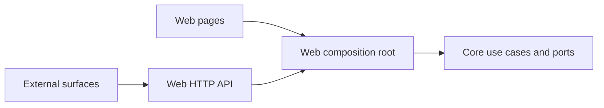

# PointUp current source navigation

PointUp is the product name; `point_bot` is the repository name. This map records committed source at the revision above. It complements the existing [architecture](../architecture.md), [API](../api.md) and [frontend integration plan](../frontend-integration-plan.md). Later commits can change these entrypoints.

## Six web page entrypoints

| Route | Source | Boundary |
| --- | --- | --- |
| `/` | [Landing page](../../apps/web/src/app/page.tsx) | Illustrative preview and sign-in or local-development entry |
| `/dashboard` | [Portfolio](../../apps/web/src/app/dashboard/page.tsx) | Session-owned portfolio |
| `/dashboard/accounts/[id]` | [Account detail](../../apps/web/src/app/dashboard/accounts/[id]/page.tsx) | Validated account identifier and owner-bound access |
| `/dashboard/agents` | [Agents](../../apps/web/src/app/dashboard/agents/page.tsx) | Session-owned capture consent, tokens and review controls |
| `/dashboard/settings` | [Settings](../../apps/web/src/app/dashboard/settings/page.tsx) | Session identity and agent-management navigation |
| `/share/[token]` | [Shared portfolio](../../apps/web/src/app/share/[token]/page.tsx) | Read-only public snapshot resolved by share token |

These are page routes, not an API endpoint count. The [web composition root](../../apps/web/src/server/container.ts) supplies use cases; framework-independent contracts and implementations live in [core](../../packages/core/src/index.ts).

The diagram is a navigation aid. Provider support, capture consent and reviewed writes have separate contracts: consult [integrations](../integrations.md), [agents](../agents.md) and [assistant agent](../assistant-agent.md). Source presence does not prove live provider availability, authenticated browser acceptance or deployment. See the [release backlog](../release-backlog.md) for dated qualification work.

This file is source MDX. No MDX rendering integration was found in the committed web dependency manifest; it does not add a web route.
