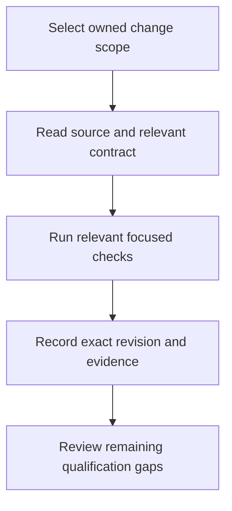

# PointUp developer reading path

Start with [current source navigation](./current-source.mdx), then the existing [local development guide](../local-development.md). That guide owns setup commands, development authentication, database bootstrapping and smoke-test instructions. Recheck its configuration requirements before executing anything; this documentation audit did not start services, invoke providers or access accounts.

## Choose the relevant contract

| Work | Read first |
| --- | --- |
| Page composition and navigation | [Frontend integration plan](../frontend-integration-plan.md) and the six linked page entrypoints |
| Domain behavior and adapters | [Architecture](../architecture.md) and [integrations](../integrations.md) |
| HTTP delivery and client behavior | [API](../api.md) and [multi-surface architecture](../multi-surface.md) |
| Capture consent and proposed changes | [Agents](../agents.md), [assistant agent](../assistant-agent.md) and [extension](../extension.md) |
| Evidence and release decisions | [Integration status](../integration-status.md), [release backlog](../release-backlog.md) and [production rollout review](../production-rollout-review.md) |

## Keep verification claims specific

Consult the current root and workspace manifests for supported scripts. Tests, type checking, builds, HTTP smoke checks, extension acceptance and authenticated browser interactions establish different things. The existing [E2E configuration](../../e2e/playwright.config.ts) and tests must be read before treating an E2E result as browser evidence.

Respect active owners and dirty worktrees. Under the shared workspace rules, one verification owner inspects running jobs and uses the foreground heavy-check gate for installs, broad tests and builds. A lock failure is a reported blocker, not a retry loop.

For these two additive guides, validation is limited to MDX compilation, local link/source checks and the exact documentation diff. Compilation does not establish Mermaid rendering or site integration. Neither guide changes runtime code, existing instructions, deployment configuration or the associated design canvas.
