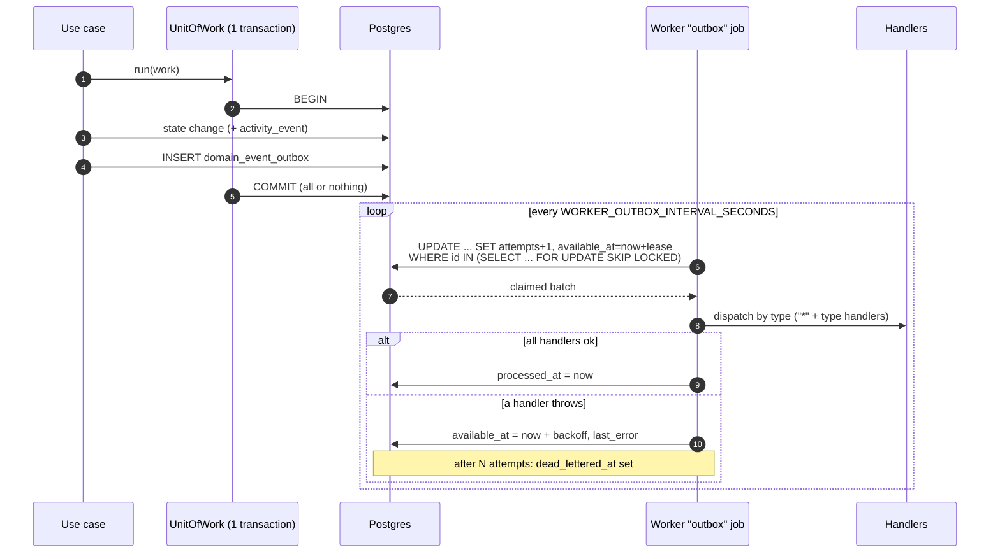

# Domain events and the transactional outbox

Use cases record **typed domain events** for the facts that matter (an account
was linked, a balance was recorded, a consent was revoked, ...). Events are
written to the `domain_event_outbox` table in the **same database transaction**
as the state change, and a worker job delivers them to in-process handlers.

The existing `activity_event` feed is unchanged and still written directly; it
is not derived from the outbox (yet).

## Event model

Defined in `packages/core/src/domain/events/`. Each event has:

| Field | Meaning |
| --- | --- |
| `id` | Unique event id (UUID); the idempotency key for handlers |
| `type` | One of `EVENT_TYPES` (a `const` tuple, so the union is closed) |
| `occurredAt` | When the fact happened |
| `userId` | Owner of the data |
| `aggregateId` | Id of the entity concerned (account, consent, token, goal, ...) |
| `version` | Payload schema version for this type (`EVENT_SCHEMA_VERSIONS`) |
| `payload` | Typed per `type` (`EventPayloads`); dates are ISO strings |
| `correlationId?` | Request/trace id when known |

`DomainEvent` is a discriminated union on `type`; use `assertNever` in a
`switch` to get compile-time exhaustiveness (see `describeEvent`).

Payloads never contain membership numbers, credential refs, token plaintext or
hashes, token/goal titles, notes, URLs, or emails. Updates list changed field
**names** only.

## Catalogue

| Type | Emitted by | Aggregate | Payload |
| --- | --- | --- | --- |
| `account.linked` | `LinkLoyaltyAccount` | account | `providerId` |
| `account.updated` | `UpdateLoyaltyAccount` | account | `providerId`, `changed[]` |
| `account.unlinked` | `UnlinkLoyaltyAccount` | account | `providerId` |
| `account.restored` | `RestoreLoyaltyAccount` | account | `providerId` |
| `balance.recorded` | `RecordManualBalance` (`manual`/`agent`), `SyncLoyaltyAccount` (`sync`) | account | `accountId`, `providerId`, `points`, `previousPoints`, `source`, `capturedAt` |
| `consent.granted` | `GrantConsent` | consent | `providerId`, `expiresAt` |
| `consent.revoked` | `RevokeConsent` (one per grant revoked) | consent | `providerId` |
| `observation.held` | `SubmitObservation` (implausible reading) | observation | `accountId`, `providerId`, `points`, `previousPoints`, `reviewExpiresAt` |
| `observation.confirmed` | `ResolveObservationReview.confirm` | observation | `accountId`, `providerId`, `points`, `previousPoints` |
| `observation.rejected` | `ResolveObservationReview.reject` | observation | `accountId`, `providerId`, `points`, `previousPoints` |
| `token.issued` | `IssueAccessToken` | token | `scopes[]`, `expiresAt` |
| `token.revoked` | `RevokeAccessToken` | token | (empty) |
| `goal.created` | `CreateTripGoal` | goal | `targetPoints` |
| `goal.updated` | `UpdateTripGoal` | goal | `changed[]` |
| `goal.deleted` | `DeleteTripGoal` | goal | (empty) |
| `watch.triggered` | `CheckAwardWatches` (a watch fired) | watch | `bestRealizedCpp`, `minCentsPerPoint` |

Notes: an agent reading that is recorded emits `balance.recorded` with
`source: "agent"` (no separate "observation recorded" event); an `unchanged`
reading emits nothing. A re-grant replaces the previous consent silently (the
replaced grant gets no `consent.revoked`). Import/seed flows emit through the
link/record use cases they call.

## How events are written (atomic)

`buildDrizzleRepositories(db)` returns repositories plus `eventing`:

- `UnitOfWork.run(work)` opens one Postgres transaction. All repository calls
  and `EventPublisher.publish` made inside it, including nested use cases,
  join that transaction. This works without changing any repository: they are
  built on a proxy of the Drizzle handle that redirects to the ambient
  transaction (AsyncLocalStorage) while `run` is active. Nested
  `db.transaction` calls (e.g. consent `replaceActive`) become savepoints.
- Every emitting use case does its writes **and** `publish` inside `run`, so a
  failure rolls back state, `activity_event` rows and outbox rows together.
  This covers all emitting flows, in particular balance recording, consent
  grant/revoke, observation hold/confirm/reject and account link/unlink.
- Hosts that build use cases without `eventing` (unit tests, ad-hoc scripts)
  get a no-op: events are dropped and behaviour is identical to before.

## Delivery semantics

- **At-least-once.** A handler can run more than once for the same event
  (crash after the side effect but before `processed_at`, lease expiry while a
  handler is slow, retry after another handler of the same event failed).
  **Handlers must be idempotent**; dedupe on `event.id`.
- **No ordering guarantee**, not even per aggregate: batches are claimed oldest
  first, but retries, backoff and concurrent workers reorder delivery. Handlers
  that care must use `occurredAt`/state, not arrival order.
- **Claiming is exclusive.** `claim` is one short `UPDATE ... WHERE id IN
  (SELECT ... FOR UPDATE SKIP LOCKED)` that increments `attempts` and pushes
  `available_at` out by a lease (default 60s). Concurrent workers never
  receive the same row while its lease is live, and no transaction stays open
  while handlers run. If a worker dies, the row reappears when the lease lapses.
- **Retry.** On handler failure the row gets `available_at = now + base * 2^(attempts-1)`
  (base 5s, cap 1h) and `last_error`.
- **Dead letter.** After `OUTBOX_MAX_ATTEMPTS` (default 8) the row is parked
  with `dead_lettered_at` and its `last_error`, and is never claimed again. Rows
  that exhaust attempts by crashing are parked on the next run. Parked rows stay
  in the table for inspection; requeue manually by clearing `dead_lettered_at`
  and resetting `attempts`/`available_at`. `OutboxProcessor` takes an
  `onDeadLetter` callback (and `onBatch`) as the metrics hook;
  `DrizzleOutboxStore.countDeadLettered()` supports a gauge.
- Events with no registered handler are marked processed.
- Processed rows are not deleted yet (see leftovers).

## Worker

`apps/worker`: job `outbox` (one-shot drain) and an `outbox` task in `loop`
(every `WORKER_OUTBOX_INTERVAL_SECONDS`, default 10). Tuning:
`OUTBOX_BATCH_SIZE` (25), `OUTBOX_MAX_ATTEMPTS` (8). Run as many workers as you
like.

Handlers shipped (`packages/core/src/application/events/handlers.ts`, wired in
`apps/worker/src/jobs/outbox.ts`):

- **log** (`*`): one JSON line per event with ids/type/version/correlation id.
  The payload is deliberately not logged.
- **notify-observation-held** (`observation.held`): sends a short message to the
  configured Slack/Discord `Notifier` (only registered when one is configured).
  The Notifier port has no idempotency key, so a retry can post twice.

Add a handler: implement `EventHandler`, `registry.on("balance.recorded", h)`
in `buildEventHandlers`.

## Schema

Migration `0013_domain_event_outbox`: `domain_event_outbox(id, type, version,
user_id, aggregate_id, payload jsonb, occurred_at, correlation_id, attempts,
available_at, processed_at, dead_lettered_at, last_error)`, a partial polling
index on `(available_at, occurred_at) WHERE processed_at IS NULL AND
dead_lettered_at IS NULL`, and RLS enabled with no policies (same posture as
0009/0011).
