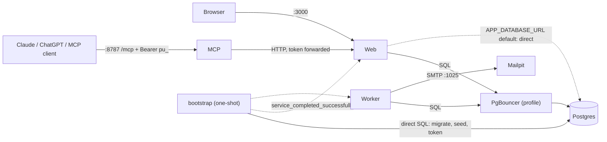

# Local development

PointUp runs locally with **one command and no external accounts** (no Clerk
keys, no AWS):

```bash
docker compose up --build
```

Then open <http://localhost:3000/dashboard>. There is no sign-in: with
`AUTH_PROVIDER=dev` every browser session is the fixed, seeded dev user
(`dev-user`) with a demo portfolio. The one-shot `bootstrap` job prints
copy-paste connection snippets for Claude Code, any MCP client and ChatGPT:

```bash
docker compose logs bootstrap
```

| Service     | URL / port                         | Notes                                                    |
| ----------- | ---------------------------------- | -------------------------------------------------------- |
| `web`       | <http://localhost:3000>            | `/api/health` (liveness), `/api/readyz` (DB ping)        |
| `mcp`       | <http://localhost:8787/mcp>        | `/healthz`, `/readyz` (web + DB); bearer `pu_` token     |
| `mailpit`   | <http://localhost:8025>            | Digests from the worker land here (SMTP `:1025`)         |
| `db`        | `localhost:5432`                   | Postgres 17, healthcheck, named volume `db-data`         |
| `bootstrap` | one-shot                           | migrate, seed demo portfolio, mint dev token, print help |
| `worker`    | -                                  | `loop` scheduler (sync 6h, digest weekly); jobs on demand |
| `adminer`   | <http://localhost:8081>            | profile `tools`                                          |
| `pgbouncer` | `localhost:6432`                   | profile `pgbouncer` (see below)                          |

All published ports are bound to `127.0.0.1`. Configuration is environment only;
every value has a default, and `.env.docker.example` lists the overrides.

## Commands

| Command                      | What it does                                                         |
| ---------------------------- | -------------------------------------------------------------------- |
| `npm run docker:up`          | `docker compose up --build -d`                                       |
| `npm run docker:up:pgbouncer`| same, with web/worker going through PgBouncer (transaction pooling)  |
| `npm run docker:down`        | stop the stack (data kept)                                           |
| `npm run docker:reset`       | drop volumes and rebuild from scratch                                |
| `npm run docker:smoke`       | end-to-end smoke test against the running stack                      |

Run a job on demand: `docker compose run --rm worker sync` (also `digest`,
`alerts`, `watch`).

## Topology



Startup order: `db` (healthy) -> `bootstrap` (exits 0) -> `web` (healthy on
`/api/health`) -> `mcp`; `worker` starts after `bootstrap` and `mailpit`.

## Dev auth mode (what it is and what protects it)

`AUTH_PROVIDER=dev|clerk` (default `clerk`; compose sets `dev`).

- No Clerk code is loaded in dev mode (provider, middleware, `UserButton`,
  `Show` are lazy-imported only in clerk mode) and no Clerk keys are needed.
- The session principal is the fixed `DEV_USER_ID`, with the same semantics as a
  Clerk session: CSRF checks, session-only routes (token minting, consent
  grants) and per-provider consent all still apply. Bearer `pu_` tokens work in
  both modes.
- **Safety:** dev auth with `NODE_ENV=production` refuses to boot (the process
  exits non-zero) unless `ALLOW_INSECURE_DEV_AUTH=true` **and** the host is not
  publicly bound: either `HOSTNAME=127.0.0.1`, or, inside a container, the port
  is published on `127.0.0.1` only and `DEV_AUTH_HOST_IS_LOOPBACK_ONLY=true`
  attests it (compose does this). The container images run with
  `NODE_ENV=production`, which is why compose sets those two flags.
- Defence in depth: the dev session only exists for loopback `Host` headers
  (`DEV_AUTH_ALLOWED_HOSTS`, default `localhost,127.0.0.1,::1`). Reaching the
  stack through another hostname gives no session. Add your hostname there if
  you browse via a LAN name.
- The `bootstrap` job mints the deterministic `POINTUP_DEV_TOKEN` only in dev
  mode, hashed in the DB like any token, scopes `portfolio:read`,
  `portfolio:write`, `observations:write` (never `consents:manage`). Granting
  consent stays a session-only action in the dashboard (or the session route, as
  the smoke test does).

Switch to real sign-in: set `AUTH_PROVIDER=clerk`, `CLERK_SECRET_KEY`,
`NEXT_PUBLIC_CLERK_PUBLISHABLE_KEY` (build arg too) in `.env`.

## Smoke test

`scripts/docker-smoke.mjs` (Node 20+, no dependencies) waits for web and MCP
health/readiness, then: calls the API with the dev token (summary, accounts),
checks least privilege (token cannot grant consent; unknown tokens 401), lists
and calls MCP tools over HTTP, and runs a consented write-back end to end: a
write without consent is refused, a foreign-`Origin` consent grant is rejected
(CSRF), the consent is granted through the session-only route, the write then
succeeds and the balance and audit trail reflect it, and revoking consent
refuses writes again. CI runs it twice (direct DB, then through PgBouncer) in
the `docker` job.

## Native development (no Docker for the app)

```bash
npm install
docker compose up -d db          # or any local Postgres
cp .env-example .env             # AUTH_PROVIDER=dev is the default there
npm run db:migrate
npm run dev
```

## How this scales later

The seams are in place; none of Kubernetes/Terraform is built here.

- **Stateless services.** `web` and `mcp` hold no state (sessions are Clerk's,
  tokens are forwarded and DB-backed). Config is environment only, there are
  `/api/health` + `/healthz` (liveness) and `/api/readyz` + `/readyz`
  (readiness) probes, and `web`, `mcp` and the worker loop drain on SIGTERM. Any of
  them can run N replicas behind a load balancer.
- **Pooling.** `createDb()` switches to `prepare: false` for transaction
  poolers (port 6432/6543 or `?pgbouncer=true`). The `pgbouncer` profile runs the
  app through a real pooler; migrations bypass it (they take a session-level
  advisory lock). Same path as Supabase.
- **Jobs.** `sync`, `digest`, `alerts`, `watch` and `migrate` are independent
  one-shot commands; the in-process `loop` is just a convenience for one
  replica. Later they become cron/scheduler-triggered tasks, and the digest/alert
  fan-out can move behind an outbox table consumed by competing workers
  (`SELECT ... FOR UPDATE SKIP LOCKED`).
- **Ports for state that must become shared.** The rate limiter
  (`apps/web/src/server/rate-limit.ts`) is an in-process implementation of the
  `RateLimiter` port; swap in a Redis/Postgres-backed adapter when running more
  than one web replica. Reads that need caching go through use cases, so a cache
  port can be added there without touching routes.
- **One image per process type** (`Dockerfile`, `.mcp`, `.worker`, `.bot`),
  non-root, with no secrets baked in: ready for any orchestrator.
