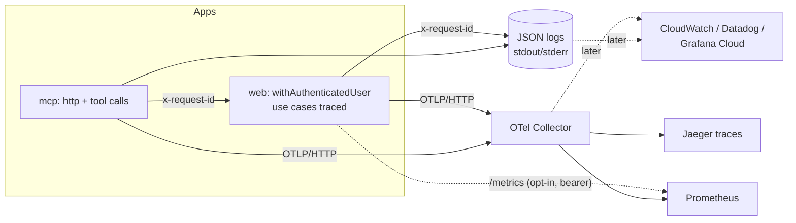

# Observability

Structured logs, traces and metrics for every surface, built on ports in
`packages/core/src/observability/` so no vendor is baked in. The only
OpenTelemetry package inside core is the tiny `@opentelemetry/api`; the SDK
and exporters are wired in the **apps** and only when
`OTEL_EXPORTER_OTLP_ENDPOINT` is set. With no endpoint nothing OTel is
imported or started (zero overhead) and metrics stay in-process.



## Ports (packages/core)

| Port | Default | Adapters |
| --- | --- | --- |
| `Logger` (`LOG_LEVELS`: debug, info, warn, error) | no-op until configured | `createConsoleLogger`: one JSON line, automatic redaction |
| `Tracer` / `withSpan(name, attrs, fn)` | `noopTracer` | `createOtelTracer` (OTel API) |
| `Metrics` (`METRIC_NAMES` / `METRIC_DEFS`) | `noopMetrics` | `PrometheusMetrics` (in-process text), `createOtelMetrics`, `combineMetrics` |

`createObservability({ service })` composes the defaults (console JSON logger,
Prometheus registry, OTel adapters only if an endpoint is configured) and
`ensureObservability` installs it once per process on `globalThis`.

### Redaction

Every application log line written through the PointUp logger goes through
`redact()` before it is written: values under keys
matching `authorization|token|secret|password|cookie|api key|credential|signature`
become `[REDACTED]` (ids like `tokenId` are kept), and inside any string
`Bearer ...` and `pu_...` personal access tokens are scrubbed. `Error`s are
serialised as fixed `{name, message, category}` metadata plus a validated public
error code when present; original names, messages, stacks, causes and payloads
are omitted. Structured `error`/`exception` fields receive the same treatment
even for thrown strings or plain objects. OTel exception events/status messages
use fixed metadata, and error/exception span attributes admit only public codes. Cycles and
deep objects are truncated. Logging never throws.

### Use-case tracing

`traced(name, useCase)` wraps `execute` in a `usecase.<name>` span and records
`use_case_calls_total` / `use_case_duration_ms`; `tracedAll(module)` wraps a
whole composed module. Arguments and results are never recorded. The web
container applies it (`apps/web/src/server/container.ts`); hosts such as the
bot or worker can do the same with one call.

## Correlation (request id)

* `x-request-id` is accepted when well formed (`[A-Za-z0-9._:-]{8,128}`),
  otherwise generated (UUID), and always returned in the response. Known secret
  strings such as a PointUp PAT, including a PAT embedded in an otherwise valid
  ID, are replaced before response echo, upstream forwarding and span creation.
* It lives in an `AsyncLocalStorage` context, so every log line carries
  `requestId` (plus `traceId`/`spanId` when a span is active) without plumbing.
* API errors: `{ "error": { "code", "message", "requestId" } }` (`requestId` is an
  additive, optional field of the `ApiError` contract; `PointUpApiError.requestId`
  exposes it to clients).
* MCP forwards its request id to the API as `X-Request-Id`, so one id spans
  MCP request, tool call and API request.

The MCP correlation regression exercises real HTTP requests and the real
OpenTelemetry SDK with an in-memory exporter. It verifies that mistaken PAT
correlation values cannot reach response headers, upstream request IDs, logs or
exported span attributes. This is local SDK evidence; it does not establish
OTLP collector or hosted dashboard delivery.

## Configuration

| Variable | Where | Meaning |
| --- | --- | --- |
| `OTEL_EXPORTER_OTLP_ENDPOINT` | web, mcp | Enables SDK + OTLP/HTTP export of traces and metrics (standard OTel vars such as `OTEL_EXPORTER_OTLP_HEADERS` also apply) |
| `OTEL_SERVICE_NAME` | web, mcp | Defaults `pointup-web` / `pointup-mcp` |
| `LOG_LEVEL` | web, mcp | `debug|info|warn|error`, default `info` |
| `METRICS_ENABLED=true` + `METRICS_TOKEN` | web | Serves Prometheus text at `GET /metrics` (404 otherwise; bearer token compared in constant time; 401 on mismatch) |

MCP logs go to stderr (stdout carries the stdio protocol).

## Health

* `GET /api/health` liveness, unchanged.
* `GET /api/readyz`: `{"status":"ready","db":{"latencyMs":1.2}}` (503
  `{"status":"unavailable"}` when the database is down). `status` is the stable
  contract; `db` is additive. Also feeds the `db_ping_latency_ms` gauge.

## Metric catalogue

| Metric | Type | Labels |
| --- | --- | --- |
| `http_requests_total` | counter | `route` (template), `method`, `status_class` |
| `http_request_duration_ms` | histogram | `route`, `method` |
| `rate_limited_total` | counter | `class` |
| `auth_failures_total` | counter | `reason` (UNAUTHENTICATED, INSUFFICIENT_SCOPE, CSRF_REJECTED) |
| `mcp_tool_calls_total` | counter | `tool`, `outcome` (ok/error) |
| `use_case_calls_total` | counter | `use_case`, `outcome` |
| `use_case_duration_ms` | histogram | `use_case` |
| `db_ping_latency_ms` | gauge | none |

The MCP server also emits `http_requests_total` / `http_request_duration_ms`
for `/mcp` and probes (unknown paths collapse to `route="other"`). Label
cardinality is capped per metric.

## Span catalogue

| Span | Attributes |
| --- | --- |
| `<METHOD> <route template>` (web API, MCP HTTP) | `http.request.method`, `http.route`, `http.response.status_code`, `request.id`, `principal.kind` (session\|token), `token.id` (never the token), `rate_limit.outcome`, `error.code` |
| `usecase.<name>` | `usecase.name`, `usecase.outcome`, `error.code` |
| `mcp.tool <tool>` | `mcp.tool`, `mcp.outcome`, `request.id` |

Per-request log line (`msg: "http_request"`): `requestId, method, route, status,
durationMs, principal, tokenId?, rateLimit, errorCode?` (warn for 4xx, error for 5xx).

## Local stack

```bash
npm run docker:up:observability      # OTEL_EXPORTER_OTLP_ENDPOINT=http://otel-collector:4318
# Jaeger (traces)      http://localhost:16686
# Prometheus (metrics) http://localhost:9090
```

Config lives in `deploy/observability/` (collector pipeline + Prometheus
scrape). Without the profile the stack is unchanged. Running outside Docker:
`OTEL_EXPORTER_OTLP_ENDPOINT=http://localhost:4318 npm run dev`.

## Production mapping (OTLP everywhere)

The apps speak OTLP only, so changing backend is a collector/endpoint change:

* **Grafana Cloud**: set `OTEL_EXPORTER_OTLP_ENDPOINT` to the stack's OTLP gateway and
  `OTEL_EXPORTER_OTLP_HEADERS=Authorization=Basic ...` (Tempo/Mimir/Loki behind it).
* **Datadog**: run the Datadog Agent with OTLP ingest (or the collector's `datadog`
  exporter) and point the endpoint at it. Logs: ship stdout JSON with the agent;
  `requestId`/`traceId` fields correlate them with traces.
* **AWS CloudWatch / X-Ray**: run the ADOT collector sidecar on ECS with an
  `awsxray` + `awsemf` exporter pair; point the endpoint at the sidecar. stdout JSON
  logs already land in CloudWatch Logs via the `awslogs` driver.

Deliberately left for later: OTLP log export (stdout JSON is the transport today),
sampling configuration (use `OTEL_TRACES_SAMPLER`), tracing the bot/worker hosts,
and a Redis-backed shared metrics view (the in-process registry is per instance).

## Assistant operations

Assistant runtime observations share the existing JSON logger, Prometheus registry
and optional OTel metric exporter. SDK tracing is a separate export path: enabling
`OTEL_EXPORTER_OTLP_ENDPOINT` does not enable SDK traces. Assistant log events use
`component=pointup_assistant`; `requestId` is the support reference, `sdkTraceId`
identifies an opt-in SDK trace, and the existing OTel `traceId` remains independent.
Token log fields are `inputTokenCount`, `outputTokenCount`, `totalTokenCount`,
`cachedInputTokenCount` and `reasoningOutputTokenCount`; unavailable cache/reasoning
counts are omitted. Counts must be nonnegative safe integers.

| Assistant metric | Type | Labels |
| --- | --- | --- |
| `assistant_run_events_total` | counter | `source`, `mode`, `outcome` |
| `assistant_run_duration_ms` | histogram | `source`, `mode`, `outcome` |
| `assistant_tool_calls_total` | counter | `source`, `mode`, `outcome` |
| `assistant_tool_duration_ms` | histogram | `source`, `mode`, `outcome` |
| `assistant_model_requests_total` | counter | `source`, `mode`, `outcome` |
| `assistant_input_tokens_total`, `assistant_output_tokens_total`, `assistant_total_tokens_total` | counter | `source`, `mode`, `outcome` |
| `assistant_cached_input_tokens_total`, `assistant_reasoning_output_tokens_total` | counter | `source`, `mode`, `outcome` |
| `assistant_action_events_total` | counter | `kind`, `status` |

Sources are `web`, `extension` or `api`; modes are `agents` or `fallback`.
Outcomes are `started`, `success`, `failed`, `timeout`, `cancelled`, `max_turns`,
`partial` or `unknown`. Run events count starts and terminal observations, so use
an outcome filter when counting runs. Run duration measures completed runs only;
tool metrics use `tool_completed`, excluding duplicate SDK lifecycle hooks.
Usage includes reported partial usage after failures. Missing or invalid counts
emit no sample. Request, user, trace and tool identifiers never become these
metric labels. Export failures cannot determine assistant success.

The web composition supplies a best-effort proposal audit sink. It logs
`component=pointup_assistant_action`, action ID, fixed kind and status, and emits
an aggregate counter with kind/status only. Proposal creation, rejection and
execution paths produce observations; repeated idempotent calls may observe the
same state again. Stalled execution recovery returns only rows actually changed
from `executing` to `unknown` and observes their fixed ID/kind/status metadata;
repeated or concurrent inspection cannot duplicate that recovery observation.
These observations remain best effort: a process crash after the database update
can lose the audit, and pending expiry has paths without an observation. No
proposal payload, private identity witness or owner becomes a log field or metric
label. The persisted proposal journal remains the source of truth for review and
execution state.

### CloudWatch dashboard and alarms

CDK attaches 14 metric filters to the existing web application log group, with
no request/user metric dimensions. The dashboard shows started/completed/failed/
cancelled runs, timeouts, maximum-turn stops, tool failures, p50/p95 completed-run
and tool latency, reported input/output/cache/reasoning tokens, model requests,
and a recent-failure support-reference log query. `AssistantDashboardName` is a
stack output. This configuration describes provisioned resources; it does not
establish that events have reached a deployed AWS account.

The failure alarm evaluates `100 * failed / started` at a 20% threshold in at
least two of three five-minute periods, only when a period has at least ten
started runs. Cancellations are excluded from the failure numerator; the
denominator remains all started runs. A second alarm requires at least five
timeouts in each of two consecutive five-minute periods. Missing data does not
breach either alarm. These are initial tuning values: inspect actual traffic
and run durations before changing the helper thresholds or evaluation windows.
No notification actions or recipient are configured; operators must configure
an approved notification destination separately if they want delivery.

### Agents configuration boundary

`-c enableAgents=true -c assistantModel=<approved-model>` opts the web task into
the SDK runtime. A blank/missing model is rejected. The optional placeholder
Secrets Manager key becomes server-only `OPENAI_API_KEY`; bot, MCP and scheduled
worker tasks receive no Agents key. Populate the placeholder with an approved key
before live inference. Existing legacy assistant configuration remains the
default when Agents is disabled.

`-c assistantTracing=true` independently enables SDK tracing for that runtime;
it defaults off. SDK tracing excludes sensitive data and uses the private
sanitizing exporter. Keep the existing OTel request correlation and JSON support
references when choosing whether to enable this separate export path.

## Worker and persisted failures

Worker operational failures use fixed categories, bounded job names, validated
public codes and generated support references. Exception text, event payloads,
owner identifiers and webhook/provider bodies do not enter those diagnostics.
Best-effort logging cannot change delivery, retry or terminal exit behavior.

New outbox failures persist `OUTBOX_DELIVERY_FAILED:<generated UUID>` and pass
the same sanitized string to the internal dead-letter hook. Retry timing, attempts
and successful error clearing remain unchanged. Hooks still receive internal
event context; that context must not be serialized into operational reporting.
This does not scrub historical rows or shorten dead-letter/event retention. A
reviewed historical scrub, finite replay window and backup-retention policy remain
release backlog items. Never classify historical rows solely by diagnostic text.
