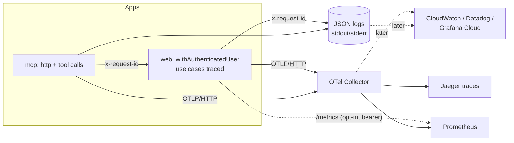

# Observability

Structured logs, traces and metrics for every surface, built on ports in
`packages/core/src/observability/` so no vendor is baked in. The only
OpenTelemetry package inside core is the tiny `@opentelemetry/api`; the SDK
and exporters are wired in the **apps** and only when
`OTEL_EXPORTER_OTLP_ENDPOINT` is set. With no endpoint nothing OTel is
imported or started (zero overhead) and metrics stay in-process.



## Ports (packages/core)

| Port | Default | Adapters |
| --- | --- | --- |
| `Logger` (`LOG_LEVELS`: debug, info, warn, error) | no-op until configured | `createConsoleLogger`: one JSON line, automatic redaction |
| `Tracer` / `withSpan(name, attrs, fn)` | `noopTracer` | `createOtelTracer` (OTel API) |
| `Metrics` (`METRIC_NAMES` / `METRIC_DEFS`) | `noopMetrics` | `PrometheusMetrics` (in-process text), `createOtelMetrics`, `combineMetrics` |

`createObservability({ service })` composes the defaults (console JSON logger,
Prometheus registry, OTel adapters only if an endpoint is configured) and
`ensureObservability` installs it once per process on `globalThis`.

### Redaction

Every log line goes through `redact()` before it is written: values under keys
matching `authorization|token|secret|password|cookie|api key|credential|signature`
become `[REDACTED]` (ids like `tokenId` are kept), and inside any string
`Bearer ...` and `pu_...` personal access tokens are scrubbed. `Error`s are
serialised as `{name, message, stack, cause}` and scrubbed too. Cycles and
deep objects are truncated. Logging never throws.

### Use-case tracing

`traced(name, useCase)` wraps `execute` in a `usecase.<name>` span and records
`use_case_calls_total` / `use_case_duration_ms`; `tracedAll(module)` wraps a
whole composed module. Arguments and results are never recorded. The web
container applies it (`apps/web/src/server/container.ts`); hosts such as the
bot or worker can do the same with one call.

## Correlation (request id)

* `x-request-id` is accepted when well formed (`[A-Za-z0-9._:-]{8,128}`),
  otherwise generated (UUID), and always returned in the response.
* It lives in an `AsyncLocalStorage` context, so every log line carries
  `requestId` (plus `traceId`/`spanId` when a span is active) without plumbing.
* API errors: `{ "error": { "code", "message", "requestId" } }` (`requestId` is an
  additive, optional field of the `ApiError` contract; `PointUpApiError.requestId`
  exposes it to clients).
* MCP forwards its request id to the API as `X-Request-Id`, so one id spans
  MCP request, tool call and API request.

## Configuration

| Variable | Where | Meaning |
| --- | --- | --- |
| `OTEL_EXPORTER_OTLP_ENDPOINT` | web, mcp | Enables SDK + OTLP/HTTP export of traces and metrics (standard OTel vars such as `OTEL_EXPORTER_OTLP_HEADERS` also apply) |
| `OTEL_SERVICE_NAME` | web, mcp | Defaults `pointup-web` / `pointup-mcp` |
| `LOG_LEVEL` | web, mcp | `debug|info|warn|error`, default `info` |
| `METRICS_ENABLED=true` + `METRICS_TOKEN` | web | Serves Prometheus text at `GET /metrics` (404 otherwise; bearer token compared in constant time; 401 on mismatch) |

MCP logs go to stderr (stdout carries the stdio protocol).

## Health

* `GET /api/health` liveness, unchanged.
* `GET /api/readyz`: `{"status":"ready","db":{"latencyMs":1.2}}` (503
  `{"status":"unavailable"}` when the database is down). `status` is the stable
  contract; `db` is additive. Also feeds the `db_ping_latency_ms` gauge.

## Metric catalogue

| Metric | Type | Labels |
| --- | --- | --- |
| `http_requests_total` | counter | `route` (template), `method`, `status_class` |
| `http_request_duration_ms` | histogram | `route`, `method` |
| `rate_limited_total` | counter | `class` |
| `auth_failures_total` | counter | `reason` (UNAUTHENTICATED, INSUFFICIENT_SCOPE, CSRF_REJECTED) |
| `mcp_tool_calls_total` | counter | `tool`, `outcome` (ok/error) |
| `use_case_calls_total` | counter | `use_case`, `outcome` |
| `use_case_duration_ms` | histogram | `use_case` |
| `db_ping_latency_ms` | gauge | none |

The MCP server also emits `http_requests_total` / `http_request_duration_ms`
for `/mcp` and probes (unknown paths collapse to `route="other"`). Label
cardinality is capped per metric.

## Span catalogue

| Span | Attributes |
| --- | --- |
| `<METHOD> <route template>` (web API, MCP HTTP) | `http.request.method`, `http.route`, `http.response.status_code`, `request.id`, `principal.kind` (session\|token), `token.id` (never the token), `rate_limit.outcome`, `error.code` |
| `usecase.<name>` | `usecase.name`, `usecase.outcome`, `error.code` |
| `mcp.tool <tool>` | `mcp.tool`, `mcp.outcome`, `request.id` |

Per-request log line (`msg: "http_request"`): `requestId, method, route, status,
durationMs, principal, tokenId?, rateLimit, errorCode?` (warn for 4xx, error for 5xx).

## Local stack

```bash
npm run docker:up:observability      # OTEL_EXPORTER_OTLP_ENDPOINT=http://otel-collector:4318
# Jaeger (traces)      http://localhost:16686
# Prometheus (metrics) http://localhost:9090
```

Config lives in `deploy/observability/` (collector pipeline + Prometheus
scrape). Without the profile the stack is unchanged. Running outside Docker:
`OTEL_EXPORTER_OTLP_ENDPOINT=http://localhost:4318 npm run dev`.

## Production mapping (OTLP everywhere)

The apps speak OTLP only, so changing backend is a collector/endpoint change:

* **Grafana Cloud**: set `OTEL_EXPORTER_OTLP_ENDPOINT` to the stack's OTLP gateway and
  `OTEL_EXPORTER_OTLP_HEADERS=Authorization=Basic ...` (Tempo/Mimir/Loki behind it).
* **Datadog**: run the Datadog Agent with OTLP ingest (or the collector's `datadog`
  exporter) and point the endpoint at it. Logs: ship stdout JSON with the agent;
  `requestId`/`traceId` fields correlate them with traces.
* **AWS CloudWatch / X-Ray**: run the ADOT collector sidecar on ECS with an
  `awsxray` + `awsemf` exporter pair; point the endpoint at the sidecar. stdout JSON
  logs already land in CloudWatch Logs via the `awslogs` driver.

Deliberately left for later: OTLP log export (stdout JSON is the transport today),
sampling configuration (use `OTEL_TRACES_SAMPLER`), tracing the bot/worker hosts,
and a Redis-backed shared metrics view (the in-process registry is per instance).
