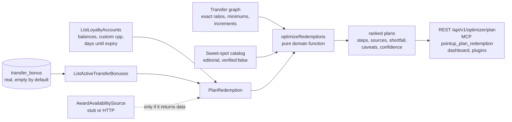

# Redemption optimizer

"Find deals and optimally use points." Given a user's balances, the transfer
graph, any active transfer bonuses and a curated sweet-spot catalog, the
optimizer returns ranked, explainable plans. It is deterministic, uses integer
points and rational ratios, and is deliberately honest about what it does not
know.

## Data flow

## Model

A plan books one **sweet spot** (a typical redemption at a program, such as
"Hyatt category 1-4 standard nights") for `units` units. The target program's
points can come from

- the user's **direct balance** in that program (ratio 1:1, no minimum), and
- a **transfer** out of any held currency with an edge to it, with the edge's
  exact ratio as a rational (decimal ratios such as 1:1.5 are reduced to 3/2),
  the best active **bonus** on that edge, and its minimum/increment (the
  default block is 1,000 source points unless the edge says otherwise; this is
  stated in the caveats).

Transfers may be **split** across several currencies.

Conversion is one function, `convertPoints(edge, sourcePoints, bonusPermille)`:
`floor(floor(source * num / den) * permille / 1000)`. The optimizer calls it for
every source, so a plan can never disagree with it. Bonuses are stored as
integer permille (1300 = +30%).

## Algorithm

For each candidate spot (filtered by goal kind and target program):

1. Build sources: direct balance plus each held currency with an edge. Each
   source point has an **opportunity cost**: the user's own valuation of that
   currency (custom valuation, else editorial), discounted to 50% when the
   points expire within 90 days and 25% within 30 days, so expiring points are
   spent first.
2. Order sources by cost per destination point (direct balance wins ties).
3. Choose units: the explicit `quantity`, else for nights up to 3 (or what
   balances cover), for tickets and packages 1.
4. Fund `units * pointsCost` destination points. We evaluate the plain
   **greedy** fill and, for every source, "all cheaper sources in full, then
   this source covers the remainder (rounded up to its minimum block)".
   That is exact for linear yields and handles the discontinuities from
   minimums, increments and flooring on the marginal source. It is bounded
   (`O(n^2)` per spot, n = sources into one program) but **a heuristic, not a
   proof of global optimality**.
5. If balances cannot cover it the plan is a **shortfall**: it lists what the
   best sources would give, how many destination points are missing, and which
   programs could cover the gap via transfer (with the source points needed,
   whether the user holds enough, and any active bonus). Shortfall plans are
   shown only when the user is within 4x of the cost or asked about that
   program.

Ranking: fundable plans first, by `rankScoreCents` (value of the redemption
minus the discounted opportunity cost of the points spent), then effective
cents-per-point, then id. Shortfalls follow, closest first. There is no
randomness anywhere; identical input gives identical output (tested).

Each plan carries `steps`, `sources` (points used per source program),
`effectiveCentsPerPoint`, `valueCents`, `netGainCents`, `shortfall`,
`expiryUrgency`, `confidence` and `caveats`.

## Honesty and limits

- **Availability is never invented.** Plans say award availability is NOT
  verified. `availability` on a plan is non-null only when the configured
  `AwardAvailabilitySource` returned options for that plan's program. With no
  `AWARD_SEARCH_API_URL`/`KEY` the stub returns `not_configured` and no plan is
  annotated.
- **The sweet-spot catalog is editorial.** Every entry is `verified: false`,
  medium or low confidence (nothing is "high"), with *typical* points ranges and
  rough cash values used only to derive cents-per-point. They are not live
  prices. Charts change without notice; `lastReviewed` is 2026-10-01.
- **Transfer bonuses are real data, empty by default.** Nothing is shown unless
  someone recorded it (`manual`, `scraped` or `user`). A bonus that is not
  verified caps the plan's confidence at medium and adds a caveat. Any
  `portfolio:write` caller can report one (stored as `user`, unverified) and it
  then affects every user's plans: this is a crowd-data trust trade-off, there
  is no moderation workflow yet.
- **Value is relative to the user's own valuations** (custom cents-per-point if
  set). "Net gain" means "better than what those points are worth to you".
- Not modelled: taxes/fees, point expiry resets from transfers, transfer
  delays, card-specific ratios beyond the notes on each edge, taxes on partner
  awards, and multi-passenger awards. Transfers are irreversible; the plan
  repeats this and the plugins instruct agents to relay it.

## Transfer bonuses

Table `transfer_bonus` (migration `0014`): `id`, `from_provider_id`,
`to_provider_id`, `multiplier_permille`, `starts_at`, `ends_at`, `source`
(`manual|scraped|user`), `source_url`, `verified_at`, `created_by`,
`created_at`, with CHECK constraints (`1000 < permille <= 3000`,
`ends_at > starts_at`) and RLS on with no policies (same posture as other
tables). `RecordTransferBonus` validates (ids in the catalog, the edge exists in
the transfer graph, `1.0 < multiplier <= 3.0`, window order, http(s) source
URL) and emits `transfer_bonus.recorded` in the same transaction.
`ListActiveTransferBonuses` returns windows containing "now". An expiry job is
not needed: expired rows are simply not returned.

## Surfaces

| Surface | Entry |
| --- | --- |
| REST | `GET /api/v1/optimizer/plan`, `GET /api/v1/deals/sweet-spots`, `GET`/`POST /api/v1/transfer-bonuses` |
| MCP | `pointup_plan_redemption`, `pointup_list_sweet_spots`, `pointup_list_transfer_bonuses`, `pointup_record_transfer_bonus`; prompt `find-deals` |
| Claude plugin | skills `plan-redemption`, `find-deals` |
| ChatGPT | operations `planRedemption`, `listSweetSpots`, `listTransferBonuses`, `recordTransferBonus` |
| Dashboard | "Best ways to use your points" |

The older `GetValueAdvice` and curated `CATALOG_DEALS` still work; the
"demo" transfer bonuses it used to show were removed (no bonus is ever shown
unless it is real data).

## Transfer-bonus trust model

Bonuses are crowd/manual data and nothing is shown by default. A bonus a user
reports is stored as `source: "user"`, unverified, and is **visible only to the
user who reported it**: it shapes that user's own plans and no one else's.
Otherwise any user with a write-capable token could skew every other user's
recommendations with a fake bonus. System/scraped bonuses and user reports that
a trusted party has verified (`verifiedAt` set) apply to everyone. There is no
verification endpoint yet; until one exists, user reports stay private to their
reporter.
